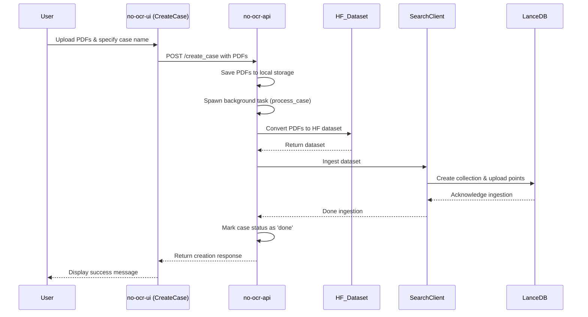
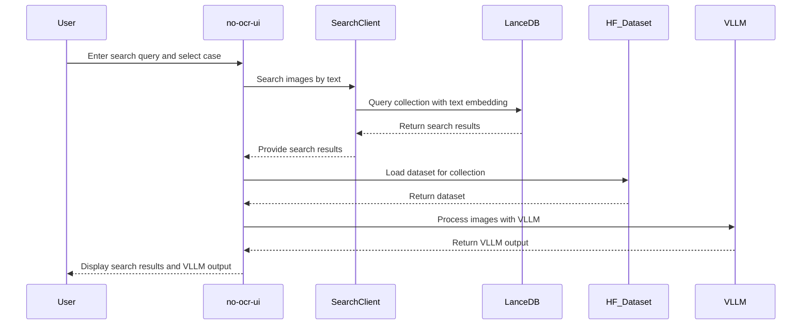

## Introduction

NoOCR is a SaaS application for AI-powered document exploration without traditional OCR. The system processes PDF documents by converting pages to images, embedding them using vision-language models, and enabling semantic search and visual question-answering.

## High-Level Architecture

The NoOCR system consists of three main components working together:

<CardGroup cols={3}>
  <Card title="FastAPI Backend" icon="server" href="/architecture/backend">
    Python-based API handling PDF ingestion, vector search, and coordination
  </Card>
  <Card title="React Frontend" icon="browser" href="/architecture/frontend">
    Modern TypeScript UI for uploading documents and searching
  </Card>
  <Card title="Modal LLM Serving" icon="brain" href="/architecture/llm-serving">
    Serverless GPU infrastructure for ColPali embeddings and Qwen2-VL inference
  </Card>
</CardGroup>

## Data Flow

The system follows a clear pipeline from document upload to search results:

### 1. Document Ingestion Flow



**Key Steps:**

1. **PDF Upload**: User uploads PDF files through the React UI
2. **Storage**: Backend saves PDFs to local storage (organized by user_id and case_name)
3. **Background Processing**: FastAPI spawns a background task to process the case
4. **Dataset Creation**: PDFs are converted to a Hugging Face dataset with page images
5. **Embedding Generation**: ColPali model generates multi-vector embeddings for each page
6. **Vector Indexing**: Embeddings are stored in LanceDB with metadata
7. **Status Update**: Case status updated to "done" when processing completes

### 2. Search and Query Flow



**Key Steps:**

1. **Query Embedding**: User query is embedded using ColPali text encoder
2. **Vector Search**: LanceDB performs cosine similarity search across page embeddings
3. **Result Retrieval**: Top-k most relevant pages are returned with metadata
4. **Image Loading**: Original page images are loaded from the HF dataset
5. **Visual QA**: Qwen2-VL processes each image with the user query
6. **Answer Extraction**: Model generates answers indicating if the page contains relevant information
7. **Display**: Results shown to user with images and extracted answers

## Technology Stack

### Backend
- **FastAPI**: Modern async web framework for Python
- **LanceDB**: Embedded vector database optimized for multi-vector search
- **Hugging Face Datasets**: Efficient storage and loading of page images
- **pdf2image**: PDF to image conversion
- **pypdf**: PDF metadata extraction

### Frontend
- **React 18**: Component-based UI framework
- **TypeScript**: Type-safe JavaScript
- **Vite**: Fast build tool and dev server
- **Tailwind CSS**: Utility-first CSS framework
- **Zustand**: Lightweight state management
- **Supabase**: Authentication and user management

### LLM Infrastructure
- **Modal**: Serverless GPU platform
- **vLLM**: High-performance inference server
- **ColPali (colqwen2-v1.0-merged)**: Multi-vector embeddings for document pages
- **Qwen2-VL-7B-Instruct**: Vision-language model for visual question answering

## Storage Organization

The backend uses a hierarchical storage structure:

```
storage/
├── {user_id}/
│   └── {case_name}/
│       ├── case_info.json          # Case metadata
│       ├── {document1}.pdf         # Original PDFs
│       ├── {document2}.pdf
│       └── hf_dataset/             # Hugging Face dataset
│           ├── dataset_info.json
│           ├── data-00000-of-00001.arrow
│           └── state.json
└── common_cases/                   # Shared demo cases
    └── {case_name}/
        └── ...
```

Each case maintains:
- **case_info.json**: Metadata including status, number of PDFs, file list
- **Original PDFs**: Preserved for reference
- **HF Dataset**: Processed page images with metadata (pdf_name, pdf_page, index)

## Vector Database Schema

LanceDB tables use the following schema:

```python
schema = pa.schema(
    [
        pa.field("index", pa.int64()),
        pa.field("pdf_name", pa.string()),
        pa.field("pdf_page", pa.int64()),
        pa.field("vector", pa.list_(pa.list_(pa.float32(), 128))),
    ]
)
```

**Fields:**
- `index`: Global index across all pages in the case
- `pdf_name`: Source PDF filename
- `pdf_page`: Page number (1-indexed)
- `vector`: Multi-vector embedding (128-dimensional ColPali embeddings)

## Security & Authentication

- **Frontend**: Supabase handles user authentication with JWT tokens
- **Backend**: Input validation with regex patterns to prevent path traversal
- **Modal Services**: Bearer token authentication for API access
- **CORS**: Configured for cross-origin requests between frontend and backend

## Deployment

The system can be deployed in multiple configurations:

<Tabs>
  <Tab title="Development">
    - Local FastAPI server: `fastapi dev api.py`
    - Local Vite dev server: `npm run dev`
    - Modal services: Deployed to Modal cloud
  </Tab>
  <Tab title="Docker">
    - Docker Compose orchestrates all services
    - Containers for API, UI, and vector database
    - Environment variables configured via `.env` files
  </Tab>
  <Tab title="Production">
    - Backend: Railway, Render, or custom infrastructure
    - Frontend: Vercel, Netlify, or static hosting
    - LLM Services: Modal serverless GPU platform
    - Database: Managed LanceDB or self-hosted
  </Tab>
</Tabs>

## Next Steps

Explore the detailed documentation for each component:

- [Backend Architecture](/architecture/backend) - Deep dive into the FastAPI backend
- [Frontend Architecture](/architecture/frontend) - React UI implementation details
- [LLM Serving](/architecture/llm-serving) - Modal deployment and model serving