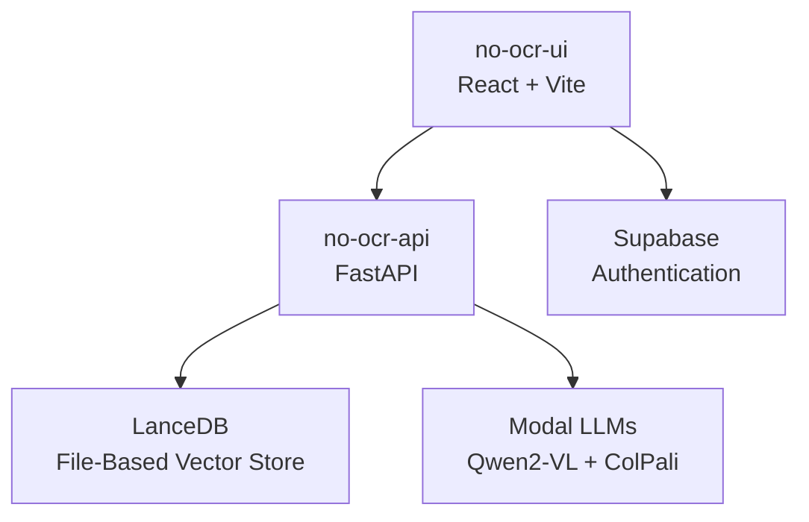

## Deployment Options

NoOCR offers two primary deployment approaches depending on your use case:

<CardGroup cols={2}>
  <Card title="Docker Deployment" icon="docker" href="/deployment/docker">
    Production-ready containerized deployment with all services orchestrated via docker-compose
  </Card>
  <Card title="Development Mode" icon="code" href="/deployment/development">
    Local development setup with hot-reloading for the API and UI
  </Card>
</CardGroup>

## Architecture

NoOCR consists of three main components:

### Core Services

- **no-ocr-ui**: React-based frontend built with Vite and TypeScript
- **no-ocr-api**: FastAPI backend that handles PDF processing and search
- **LanceDB**: File-based vector database for storing document embeddings (integrated into API service)

### External Services

- **Supabase**: Provides authentication and user management
- **Modal**: Hosts the LLM models (Qwen2-VL for VQA, ColPali for embeddings)

## Which Deployment Method?

<AccordionGroup>
  <Accordion title="Use Docker for Production">
    Docker deployment is recommended for:
    - Production environments
    - Team collaboration with consistent environments
    - Easy scaling and service orchestration
    - Complete isolation with containerized services
    
    All services run in containers with proper networking and volume management for persistent storage.
  </Accordion>

  <Accordion title="Use Development Mode for Local Work">
    Development mode is ideal for:
    - Active feature development
    - Quick iterations with hot-reloading
    - Debugging and testing
    - Learning the codebase
    
    Services run directly on your host machine with full access to source code.
  </Accordion>
</AccordionGroup>

## Next Steps

<Steps>
  <Step title="Review Prerequisites">
    Check the [prerequisites page](/deployment/prerequisites) to set up required services like Supabase and Modal.
  </Step>
  
  <Step title="Choose Your Deployment">
    Follow either the [Docker deployment guide](/deployment/docker) or [development setup guide](/deployment/development).
  </Step>
  
  <Step title="Deploy LLM Models">
    Deploy the required models to Modal as described in the prerequisites.
  </Step>
</Steps>