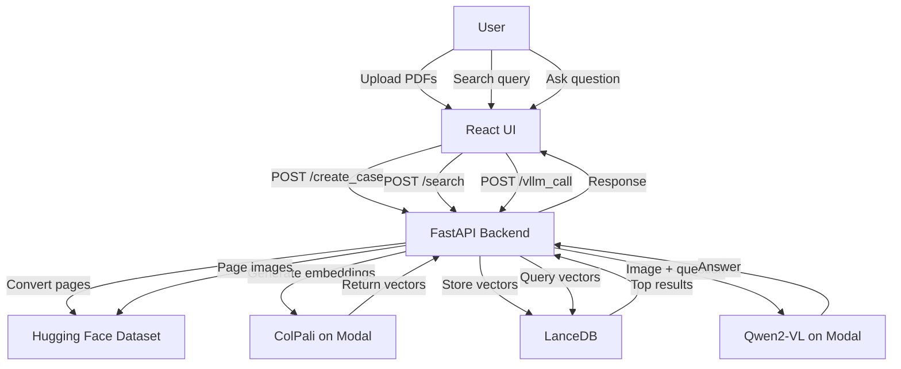

## What is NoOCR?

NoOCR is an AI-powered document exploration tool that lets you search and ask questions about PDFs without relying on traditional Optical Character Recognition (OCR). Instead of extracting and indexing text, NoOCR uses **visual embeddings** to understand document content—making it ideal for documents with complex layouts, diagrams, charts, or handwriting.

<Note>
NoOCR simplifies AI-based PDF processing by storing visual representations of document pages and enabling both text-based search and visual question-answering.
</Note>

## Why NoOCR?

Traditional OCR systems struggle with:
- **Complex layouts** with mixed text and graphics
- **Diagrams and charts** where spatial relationships matter
- **Handwritten content** that's difficult to extract accurately
- **Non-standard fonts** or distorted text
- **Documents where layout is part of the meaning** (forms, tables, infographics)

NoOCR sidesteps these issues by treating each PDF page as an image and using modern vision-language models to understand content directly from the visual representation.

<CardGroup cols={2}>
  <Card title="No Text Extraction" icon="ban">
    Skip the fragile OCR pipeline—process documents as images
  </Card>
  <Card title="Visual Understanding" icon="eye">
    Use ColPali embeddings to search based on visual content
  </Card>
  <Card title="AI Question-Answering" icon="messages-question">
    Ask questions about diagrams, charts, and text using Qwen2-VL
  </Card>
  <Card title="Fast Retrieval" icon="bolt">
    Vector search with LanceDB for instant results
  </Card>
</CardGroup>

## Key Features

### Case-Based Document Management

Organize your PDFs into **cases**—logical collections of related documents. Each case:
- Stores uploaded PDFs in a structured directory
- Automatically converts pages to images using `pdf2image`
- Creates a Hugging Face dataset for efficient access
- Maintains metadata about the number of files and processing status

```python
# From api.py:256
@app.post("/create_case")
def create_new_case(
    user_id: str = Form(...),
    files: List[UploadFile] = File(...),
    case_name: str = Form(...),
    background_tasks: BackgroundTasks = BackgroundTasks(),
) -> CaseInfo:
    """
    Create a new case for a specific user, store the uploaded PDFs, and process/ingest them.
    """
```

### Visual Search with ColPali

NoOCR uses [ColPali](https://github.com/illuin-tech/colpali)—a vision retrieval model—to create multi-vector embeddings for each PDF page. When you search:

1. Your text query is embedded using ColPali
2. The query vector is compared against stored page embeddings in LanceDB
3. The most visually similar pages are returned

```python
# From search.py:125
def search_images_by_text(self, query_text, case_name: str, user_id: str, top_k: int):
    lance_client = lancedb.connect(f"{self.storage_dir}/{user_id}/{case_name}")
    tbl = lance_client.open_table(case_name)
    
    query_embedding = self.colpali_client.query_text(query_text)
    multivector_query = np.array(query_embedding["embedding"])
    search_result = tbl.search(multivector_query).limit(top_k).select(["index", "pdf_name", "pdf_page"]).to_list()
    
    return search_result
```

### AI Question-Answering

After finding relevant pages, you can ask detailed questions about specific images. NoOCR uses **Qwen2-VL-7B-Instruct**—a vision-language model—to analyze the image and provide answers.

```python
# From search.py:142
def call_vllm(image_data: PIL.Image.Image, user_query: str, base_url: str, api_key: str, model: str) -> ImageAnswer:
    prompt = f"""
    Based on the user's query:
    ###
    {user_query}
    ###
    
    and the provided image, determine if the image contains enough information to answer the query.
    If it does, provide the most accurate answer possible based on the image.
    If it does not, respond with the exact phrase "NA".
    """
    
    client = OpenAI(base_url=base_url, api_key=api_key)
    completion = client.beta.chat.completions.parse(
        model=model,
        messages=[...],
        response_format=ImageAnswer,
    )
```

### Automated Dataset Creation

Each case is converted into a Hugging Face dataset containing:
- **Image**: The rendered PDF page
- **Index**: Global page index across all PDFs
- **PDF Name**: Source file name
- **PDF Page**: Page number within the PDF
- **Page Text**: Extracted text (for reference, not used in search)

```python
# From data.py:36
def pdfs_to_hf_dataset(path_to_folder):
    data = []
    global_index = 0
    
    folder_path = Path(path_to_folder)
    pdf_files = list(folder_path.glob("*.pdf"))
    for pdf_file in tqdm(pdf_files, desc="Processing PDFs"):
        images, page_texts = get_pdf_images(str(pdf_file))
        
        for page_number, (image, text) in enumerate(zip(images, page_texts)):
            data.append({
                "image": image,
                "index": global_index,
                "pdf_name": pdf_file.name,
                "pdf_page": page_number + 1,
                "page_text": text,
            })
            global_index += 1
    
    dataset = Dataset.from_list(data)
    return dataset
```

## How It Works

<Steps>
  <Step title="Upload PDFs">
    Create a case and upload one or more PDF files. They're saved to local storage organized by user ID and case name.
  </Step>
  
  <Step title="Convert to Images">
    Each PDF page is converted to a high-quality JPEG image (150 DPI) using `pdf2image`.
  </Step>
  
  <Step title="Generate Embeddings">
    Every page image is processed through ColPali to create a multi-vector embedding (128-dimensional vectors).
  </Step>
  
  <Step title="Index in LanceDB">
    Embeddings are stored in LanceDB with metadata, creating a searchable vector index with cosine similarity.
  </Step>
  
  <Step title="Search">
    When you search, your query text is embedded and compared against all page embeddings to find the most relevant pages.
  </Step>
  
  <Step title="Ask Questions">
    Select a specific page and ask questions. Qwen2-VL analyzes the image and provides detailed answers.
  </Step>
</Steps>

## Architecture Overview



<Note>
Both ColPali and Qwen2-VL are deployed on [Modal](https://modal.com/) for scalable, serverless GPU inference.
</Note>

## Use Cases

<CardGroup cols={2}>
  <Card title="Technical Documentation" icon="book">
    Search across product manuals, API docs, and technical specifications with complex diagrams
  </Card>
  <Card title="Research Papers" icon="flask">
    Find relevant figures, charts, and equations across a collection of academic papers
  </Card>
  <Card title="Legal Documents" icon="scale-balanced">
    Navigate contracts, agreements, and legal filings with preserved formatting
  </Card>
  <Card title="Financial Reports" icon="chart-line">
    Query annual reports, financial statements, and presentations with tables and charts
  </Card>
  <Card title="Medical Records" icon="notes-medical">
    Search through patient records, lab results, and imaging reports
  </Card>
  <Card title="Engineering Drawings" icon="compass-drafting">
    Explore blueprints, CAD exports, and technical schematics
  </Card>
</CardGroup>

## What's Next?

<Card title="Get Started with NoOCR" icon="rocket" href="/quickstart">
  Follow the quickstart guide to deploy NoOCR and create your first case
</Card>

<CardGroup cols={2}>
  <Card title="Deploy with Docker" icon="docker" href="/deployment/docker">
    Use Docker Compose to run the full stack
  </Card>
  <Card title="Development Setup" icon="code" href="/deployment/development">
    Set up a local development environment
  </Card>
  <Card title="API Reference" icon="book-open" href="/api/overview">
    Explore the REST API endpoints
  </Card>
  <Card title="Architecture Details" icon="diagram-project" href="/architecture/overview">
    Learn about the system architecture
  </Card>
</CardGroup>
